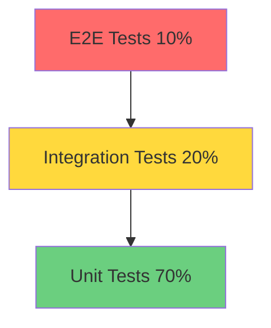

# Mon-Gene テスト戦略

## 📋 概要

**目的**: 高品質なコードベースの維持と継続的な改善  
**目標カバレッジ**: 80%以上  
**テストピラミッド**: ユニット70% / 統合20% / E2E10%

---

## 🎯 テスト方針

### 基本原則

1. **テストファースト**: 新機能は必ずテストを先に書く
2. **独立性**: 各テストは他のテストに依存しない
3. **再現性**: 同じ条件で常に同じ結果を返す
4. **高速性**: ユニットテストは1秒以内に完了
5. **可読性**: テストコードも本番コード同様に読みやすく

### テストレベル



---

## 🧪 ユニットテスト（70%）

### 対象

- ドメインロジック
- ビジネスルール
- 値オブジェクト
- エンティティ
- ユースケース（モック使用）

### ツール

**バックエンド（Go）**
```bash
# テストフレームワーク
go get -u github.com/stretchr/testify

# モック生成
go get -u github.com/golang/mock/mockgen

# カバレッジ
go test -cover ./...
```

**フロントエンド（TypeScript）**
```bash
# テストフレームワーク
npm install --save-dev vitest @testing-library/react @testing-library/jest-dom

# カバレッジ
npm test -- --coverage
```

### 実装例

#### バックエンド: ドメインエンティティのテスト

```go
// back/test/unit/domain/problem/entity_test.go
package problem_test

import (
    "testing"
    "github.com/stretchr/testify/assert"
    "github.com/mon-gene/back/internal/domain/problem"
)

func TestProblem_UpdateContent(t *testing.T) {
    tests := []struct {
        name        string
        problem     *problem.Problem
        newContent  problem.Content
        wantErr     bool
        errMessage  string
    }{
        {
            name:       "正常なコンテンツ更新",
            problem:    createTestProblem(),
            newContent: problem.NewContent("新しい問題文"),
            wantErr:    false,
        },
        {
            name:       "空のコンテンツでエラー",
            problem:    createTestProblem(),
            newContent: problem.NewContent(""),
            wantErr:    true,
            errMessage: "コンテンツは空にできません",
        },
    }

    for _, tt := range tests {
        t.Run(tt.name, func(t *testing.T) {
            err := tt.problem.UpdateContent(tt.newContent)
            
            if tt.wantErr {
                assert.Error(t, err)
                assert.Contains(t, err.Error(), tt.errMessage)
            } else {
                assert.NoError(t, err)
                assert.Equal(t, tt.newContent, tt.problem.Content())
            }
        })
    }
}

func TestUser_CanGenerateProblem(t *testing.T) {
    tests := []struct {
        name     string
        user     *user.User
        expected bool
    }{
        {
            name:     "上限未達のユーザー",
            user:     createUserWithCount(5, 10),
            expected: true,
        },
        {
            name:     "上限到達のユーザー",
            user:     createUserWithCount(10, 10),
            expected: false,
        },
        {
            name:     "無制限ユーザー",
            user:     createUnlimitedUser(),
            expected: true,
        },
    }

    for _, tt := range tests {
        t.Run(tt.name, func(t *testing.T) {
            result := tt.user.CanGenerateProblem()
            assert.Equal(t, tt.expected, result)
        })
    }
}

// ヘルパー関数
func createTestProblem() *problem.Problem {
    return problem.NewProblem(
        user.NewID("user-123"),
        problem.NewSubject("空間図形"),
        problem.NewContent("テスト問題"),
        problem.NewSolution("テスト解答"),
    )
}
```

#### バックエンド: ユースケースのテスト（モック使用）

```go
// back/test/unit/application/problem/generate_usecase_test.go
package problem_test

import (
    "context"
    "testing"
    "github.com/golang/mock/gomock"
    "github.com/stretchr/testify/assert"
)

func TestGenerateUseCase_Execute(t *testing.T) {
    ctrl := gomock.NewController(t)
    defer ctrl.Finish()

    // モックの作成
    mockProblemRepo := mock_domain.NewMockProblemRepository(ctrl)
    mockUserRepo := mock_domain.NewMockUserRepository(ctrl)
    mockStrategy := mock_generation.NewMockStrategy(ctrl)
    mockLogger := mock_logger.NewMockLogger(ctrl)

    // ユースケースの作成
    useCase := problem.NewGenerateUseCase(
        mockStrategy,
        mockProblemRepo,
        mockUserRepo,
        mockLogger,
    )

    t.Run("正常な問題生成", func(t *testing.T) {
        ctx := context.Background()
        req := problem.GenerateRequest{
            UserID:  "user-123",
            Subject: "空間図形",
            Mode:    "five_stage",
        }

        // モックの期待値設定
        mockUser := createMockUser()
        mockUserRepo.EXPECT().
            FindByID(ctx, "user-123").
            Return(mockUser, nil)

        mockProblem := createMockProblem()
        mockStrategy.EXPECT().
            Generate(ctx, gomock.Any()).
            Return(&generation.GenerationResult{
                Problem: mockProblem,
            }, nil)

        mockProblemRepo.EXPECT().
            Save(ctx, mockProblem).
            Return(nil)

        mockUserRepo.EXPECT().
            Update(ctx, mockUser).
            Return(nil)

        // 実行
        result, err := useCase.Execute(ctx, req)

        // 検証
        assert.NoError(t, err)
        assert.NotNil(t, result)
        assert.Equal(t, mockProblem.ID(), result.ProblemID)
    })

    t.Run("生成回数上限エラー", func(t *testing.T) {
        ctx := context.Background()
        req := problem.GenerateRequest{
            UserID: "user-123",
        }

        // 上限到達ユーザー
        mockUser := createUserAtLimit()
        mockUserRepo.EXPECT().
            FindByID(ctx, "user-123").
            Return(mockUser, nil)

        // 実行
        result, err := useCase.Execute(ctx, req)

        // 検証
        assert.Error(t, err)
        assert.Nil(t, result)
        assert.Contains(t, err.Error(), "上限に達しました")
    })
}
```

#### フロントエンド: コンポーネントのテスト

```typescript
// front/features/problem/components/__tests__/GenerationForm.test.tsx
import { render, screen, fireEvent, waitFor } from '@testing-library/react';
import { describe, it, expect, vi } from 'vitest';
import { GenerationForm } from '../GenerationForm';
import { QueryClient, QueryClientProvider } from '@tanstack/react-query';

describe('GenerationForm', () => {
  const queryClient = new QueryClient();
  
  const wrapper = ({ children }: { children: React.ReactNode }) => (
    <QueryClientProvider client={queryClient}>
      {children}
    </QueryClientProvider>
  );

  it('フォームが正しくレンダリングされる', () => {
    render(<GenerationForm />, { wrapper });
    
    expect(screen.getByLabelText('科目')).toBeInTheDocument();
    expect(screen.getByLabelText('プロンプト')).toBeInTheDocument();
    expect(screen.getByRole('button', { name: '生成' })).toBeInTheDocument();
  });

  it('必須項目が未入力の場合エラーが表示される', async () => {
    render(<GenerationForm />, { wrapper });
    
    const submitButton = screen.getByRole('button', { name: '生成' });
    fireEvent.click(submitButton);
    
    await waitFor(() => {
      expect(screen.getByText('科目を選択してください')).toBeInTheDocument();
      expect(screen.getByText('プロンプトを入力してください')).toBeInTheDocument();
    });
  });

  it('正常に問題生成リクエストが送信される', async () => {
    const mockGenerate = vi.fn();
    render(<GenerationForm onGenerate={mockGenerate} />, { wrapper });
    
    // フォーム入力
    fireEvent.change(screen.getByLabelText('科目'), {
      target: { value: '空間図形' },
    });
    fireEvent.change(screen.getByLabelText('プロンプト'), {
      target: { value: '球と円錐の問題' },
    });
    
    // 送信
    fireEvent.click(screen.getByRole('button', { name: '生成' }));
    
    await waitFor(() => {
      expect(mockGenerate).toHaveBeenCalledWith({
        subject: '空間図形',
        prompt: '球と円錐の問題',
        mode: 'five_stage',
      });
    });
  });
});
```

#### フロントエンド: カスタムフックのテスト

```typescript
// front/features/problem/hooks/__tests__/useGeneration.test.ts
import { renderHook, waitFor } from '@testing-library/react';
import { describe, it, expect, vi } from 'vitest';
import { useGeneration } from '../useGeneration';
import { QueryClient, QueryClientProvider } from '@tanstack/react-query';

describe('useGeneration', () => {
  const queryClient = new QueryClient();
  
  const wrapper = ({ children }: { children: React.ReactNode }) => (
    <QueryClientProvider client={queryClient}>
      {children}
    </QueryClientProvider>
  );

  it('問題生成が成功する', async () => {
    const { result } = renderHook(() => useGeneration(), { wrapper });
    
    const request = {
      subject: '空間図形',
      prompt: 'テスト',
      mode: 'five_stage',
    };
    
    result.current.mutate(request);
    
    await waitFor(() => {
      expect(result.current.isSuccess).toBe(true);
      expect(result.current.data).toBeDefined();
    });
  });

  it('エラーハンドリングが正しく動作する', async () => {
    const { result } = renderHook(() => useGeneration(), { wrapper });
    
    // エラーを発生させる
    result.current.mutate({ invalid: 'data' } as any);
    
    await waitFor(() => {
      expect(result.current.isError).toBe(true);
      expect(result.current.error).toBeDefined();
    });
  });
});
```

---

## 🔗 統合テスト（20%）

### 対象

- API エンドポイント
- データベース操作
- 外部サービス連携
- ミドルウェア

### ツール

```bash
# Go
go get -u github.com/stretchr/testify
go get -u github.com/DATA-DOG/go-sqlmock

# テストデータベース
docker-compose -f docker-compose.test.yml up -d
```

### 実装例

#### API統合テスト

```go
// back/test/integration/api/problem_test.go
package api_test

import (
    "bytes"
    "encoding/json"
    "net/http"
    "net/http/httptest"
    "testing"
    "github.com/stretchr/testify/assert"
)

func TestProblemAPI_Generate(t *testing.T) {
    // テスト用サーバーのセットアップ
    router := setupTestRouter()
    
    tests := []struct {
        name           string
        request        map[string]interface{}
        expectedStatus int
        checkResponse  func(*testing.T, map[string]interface{})
    }{
        {
            name: "正常な問題生成",
            request: map[string]interface{}{
                "subject": "空間図形",
                "prompt":  "球と円錐",
                "mode":    "five_stage",
                "opinion_profile_v2": map[string]interface{}{
                    "sub_problem_count": 3,
                },
            },
            expectedStatus: http.StatusOK,
            checkResponse: func(t *testing.T, resp map[string]interface{}) {
                assert.NotEmpty(t, resp["problem_id"])
                assert.NotEmpty(t, resp["content"])
                assert.NotEmpty(t, resp["solution"])
            },
        },
        {
            name: "必須パラメータ不足",
            request: map[string]interface{}{
                "subject": "空間図形",
            },
            expectedStatus: http.StatusBadRequest,
            checkResponse: func(t *testing.T, resp map[string]interface{}) {
                assert.Contains(t, resp["error"], "prompt")
            },
        },
    }

    for _, tt := range tests {
        t.Run(tt.name, func(t *testing.T) {
            // リクエスト作成
            body, _ := json.Marshal(tt.request)
            req := httptest.NewRequest("POST", "/api/generate-problem", bytes.NewBuffer(body))
            req.Header.Set("Content-Type", "application/json")
            req.Header.Set("Authorization", "Bearer test-token")
            
            // レスポンス記録
            w := httptest.NewRecorder()
            router.ServeHTTP(w, req)
            
            // ステータスコード検証
            assert.Equal(t, tt.expectedStatus, w.Code)
            
            // レスポンスボディ検証
            var response map[string]interface{}
            json.Unmarshal(w.Body.Bytes(), &response)
            tt.checkResponse(t, response)
        })
    }
}

func TestProblemAPI_Search(t *testing.T) {
    router := setupTestRouter()
    
    // テストデータの準備
    seedTestData(t)
    
    t.Run("キーワード検索", func(t *testing.T) {
        req := httptest.NewRequest("GET", "/api/problems/search?keyword=球", nil)
        req.Header.Set("Authorization", "Bearer test-token")
        
        w := httptest.NewRecorder()
        router.ServeHTTP(w, req)
        
        assert.Equal(t, http.StatusOK, w.Code)
        
        var response map[string]interface{}
        json.Unmarshal(w.Body.Bytes(), &response)
        
        problems := response["problems"].([]interface{})
        assert.Greater(t, len(problems), 0)
    })
}
```

#### データベース統合テスト

```go
// back/test/integration/repository/problem_repository_test.go
package repository_test

import (
    "context"
    "testing"
    "github.com/stretchr/testify/assert"
)

func TestProblemRepository_Save(t *testing.T) {
    // テストDBのセットアップ
    db := setupTestDB(t)
    defer cleanupTestDB(t, db)
    
    repo := mysql.NewProblemRepository(db, logger)
    
    t.Run("問題の保存", func(t *testing.T) {
        ctx := context.Background()
        problem := createTestProblem()
        
        err := repo.Save(ctx, problem)
        assert.NoError(t, err)
        
        // 保存確認
        saved, err := repo.FindByID(ctx, problem.ID())
        assert.NoError(t, err)
        assert.Equal(t, problem.Content(), saved.Content())
    })
}

func TestProblemRepository_Search(t *testing.T) {
    db := setupTestDB(t)
    defer cleanupTestDB(t, db)
    
    repo := mysql.NewProblemRepository(db, logger)
    
    // テストデータ投入
    seedProblems(t, repo, 10)
    
    t.Run("科目で検索", func(t *testing.T) {
        ctx := context.Background()
        criteria := domain.SearchCriteria{
            Subject: "空間図形",
            Limit:   5,
        }
        
        results, err := repo.Search(ctx, criteria)
        assert.NoError(t, err)
        assert.LessOrEqual(t, len(results), 5)
        
        for _, p := range results {
            assert.Equal(t, "空間図形", p.Subject())
        }
    })
}
```

---

## 🌐 E2Eテスト（10%）

### 対象

- ユーザーシナリオ
- クリティカルパス
- 主要機能のフロー

### ツール

```bash
# Playwright
npm install --save-dev @playwright/test
npx playwright install
```

### 実装例

```typescript
// front/e2e/problem-generation.spec.ts
import { test, expect } from '@playwright/test';

test.describe('問題生成フロー', () => {
  test.beforeEach(async ({ page }) => {
    // ログイン
    await page.goto('http://localhost:3000/login');
    await page.fill('[name="email"]', 'test@example.com');
    await page.fill('[name="password"]', 'password');
    await page.click('button[type="submit"]');
    await page.waitForURL('**/problems');
  });

  test('5段階生成で問題を作成できる', async ({ page }) => {
    // 問題生成ページへ移動
    await page.click('text=新規作成');
    
    // フォーム入力
    await page.selectOption('[name="subject"]', '空間図形');
    await page.fill('[name="prompt"]', '球と円錐が接する問題');
    await page.selectOption('[name="mode"]', 'five_stage');
    
    // 小問数設定
    await page.fill('[name="subProblemCount"]', '3');
    
    // 生成開始
    await page.click('button:has-text("生成開始")');
    
    // 進捗表示を確認
    await expect(page.locator('text=Stage 1')).toBeVisible();
    
    // 完了を待つ（最大3分）
    await page.waitForSelector('text=生成完了', { timeout: 180000 });
    
    // 結果確認
    await expect(page.locator('[data-testid="problem-content"]')).toBeVisible();
    await expect(page.locator('[data-testid="problem-solution"]')).toBeVisible();
    await expect(page.locator('[data-testid="geometry-image"]')).toBeVisible();
  });

  test('3問生成で問題を作成できる', async ({ page }) => {
    await page.click('text=新規作成');
    
    await page.selectOption('[name="subject"]', '空間図形');
    await page.fill('[name="prompt"]', 'テスト問題');
    await page.selectOption('[name="mode"]', 'three_problems');
    
    await page.click('button:has-text("生成開始")');
    
    // 3つの問題が表示されることを確認
    await page.waitForSelector('[data-testid="problem-card"]', { timeout: 180000 });
    const problemCards = await page.locator('[data-testid="problem-card"]').count();
    expect(problemCards).toBe(3);
  });

  test('問題を検索できる', async ({ page }) => {
    // 検索ページへ
    await page.click('text=検索');
    
    // キーワード検索
    await page.fill('[name="keyword"]', '球');
    await page.click('button:has-text("検索")');
    
    // 結果確認
    await expect(page.locator('[data-testid="search-results"]')).toBeVisible();
    const results = await page.locator('[data-testid="problem-card"]').count();
    expect(results).toBeGreaterThan(0);
  });

  test('問題の詳細を表示できる', async ({ page }) => {
    // 最初の問題をクリック
    await page.click('[data-testid="problem-card"]:first-child');
    
    // 詳細モーダル表示確認
    await expect(page.locator('[data-testid="problem-detail-modal"]')).toBeVisible();
    await expect(page.locator('[data-testid="problem-content"]')).toBeVisible();
    await expect(page.locator('[data-testid="problem-solution"]')).toBeVisible();
    
    // 図形再生成ボタン確認
    await expect(page.locator('button:has-text("図形を再生成")')).toBeVisible();
  });
});
```

---

## 📊 カバレッジ目標

### バックエンド

| レイヤー | 目標カバレッジ | 優先度 |
|---------|--------------|--------|
| Domain | 90%以上 | 最高 |
| Application | 85%以上 | 高 |
| Infrastructure | 70%以上 | 中 |
| Presentation | 75%以上 | 中 |

### フロントエンド

| カテゴリ | 目標カバレッジ | 優先度 |
|---------|--------------|--------|
| ビジネスロジック | 90%以上 | 最高 |
| カスタムフック | 85%以上 | 高 |
| コンポーネント | 75%以上 | 中 |
| ユーティリティ | 80%以上 | 中 |

---

## 🔄 CI/CDパイプライン

### GitHub Actions設定

```yaml
# .github/workflows/test.yml
name: Test

on:
  push:
    branches: [ main, develop ]
  pull_request:
    branches: [ main, develop ]

jobs:
  backend-test:
    runs-on: ubuntu-latest
    steps:
      - uses: actions/checkout@v3
      
      - name: Set up Go
        uses: actions/setup-go@v4
        with:
          go-version: '1.21'
      
      - name: Run tests
        run: |
          cd back
          go test -v -cover -coverprofile=coverage.out ./...
          go tool cover -html=coverage.out -o coverage.html
      
      - name: Upload coverage
        uses: codecov/codecov-action@v3
        with:
          files: ./back/coverage.out

  frontend-test:
    runs-on: ubuntu-latest
    steps:
      - uses: actions/checkout@v3
      
      - name: Set up Node.js
        uses: actions/setup-node@v3
        with:
          node-version: '18'
      
      - name: Install dependencies
        run: |
          cd front
          npm ci
      
      - name: Run tests
        run: |
          cd front
          npm test -- --coverage
      
      - name: Upload coverage
        uses: codecov/codecov-action@v3
        with:
          files: ./front/coverage/coverage-final.json

  e2e-test:
    runs-on: ubuntu-latest
    steps:
      - uses: actions/checkout@v3
      
      - name: Set up services
        run: docker-compose up -d
      
      - name: Run E2E tests
        run: |
          cd front
          npx playwright test
      
      - name: Upload test results
        if: always()
        uses: actions/upload-artifact@v3
        with:
          name: playwright-report
          path: front/playwright-report/
```

---

## 📝 テスト実行コマンド

### バックエンド

```bash
# 全テスト実行
make test

# ユニットテストのみ
make test-unit

# 統合テストのみ
make test-integration

# カバレッジレポート生成
make test-coverage

# 特定パッケージのテスト
go test -v ./internal/domain/problem/...

# ベンチマーク
go test -bench=. -benchmem ./...
```

### フロントエンド

```bash
# 全テスト実行
npm test

# ウォッチモード
npm test -- --watch

# カバレッジ
npm test -- --coverage

# E2Eテスト
npm run test:e2e

# E2Eテスト（UIモード）
npm run test:e2e:ui
```

---

## 🎯 テスト作成ガイドライン

### 良いテストの特徴

1. **FIRST原則**
   - Fast: 高速に実行される
   - Independent: 独立している
   - Repeatable: 再現可能
   - Self-validating: 自己検証可能
   - Timely: タイムリーに書かれる

2. **AAA パターン**
   - Arrange: 準備
   - Act: 実行
   - Assert: 検証

3. **明確なテスト名**
   ```go
   // Good
   func TestUser_CanGenerateProblem_WhenLimitNotReached_ReturnsTrue(t *testing.T)
   
   // Bad
   func TestUser1(t *testing.T)
   ```

### テストデータ管理

```go
// テストヘルパー
// back/test/helpers/fixtures.go
package helpers

func CreateTestUser(opts ...UserOption) *user.User {
    u := &user.User{
        ID:    "test-user-123",
        Email: "test@example.com",
        Limit: 10,
        Count: 0,
    }
    
    for _, opt := range opts {
        opt(u)
    }
    
    return u
}

type UserOption func(*user.User)

func WithLimit(limit int) UserOption {
    return func(u *user.User) {
        u.Limit = limit
    }
}

func WithCount(count int) UserOption {
    return func(u *user.User) {
        u.Count = count
    }
}
```

---

## 📈 継続的改善

### 定期レビュー

- **週次**: テスト失敗の分析
- **月次**: カバレッジレビュー
- **四半期**: テスト戦略の見直し

### メトリクス監視

- テスト実行時間
- カバレッジ推移
- フレーキーテストの検出
- テスト追加率

---

**最終更新**: 2025-12-11  
**バージョン**: 1.0  
**ステータス**: レビュー待ち