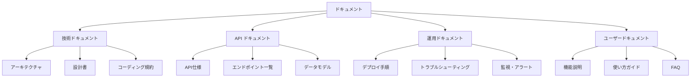
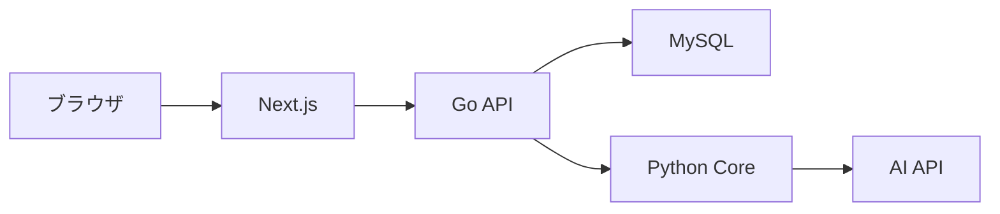
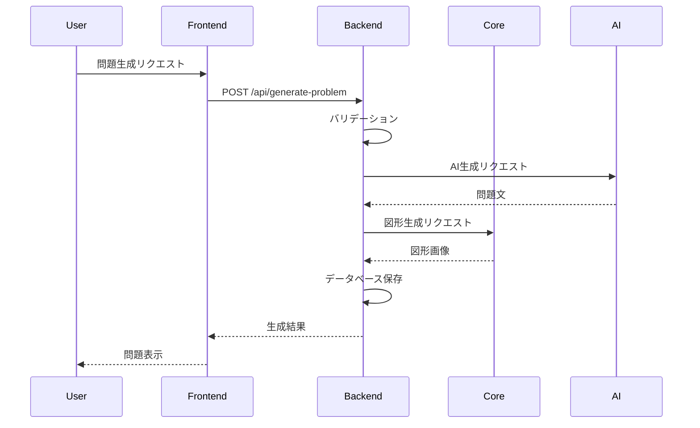
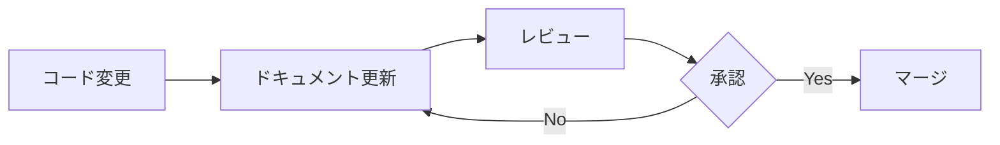

# Mon-Gene ドキュメント整備計画

## 📋 概要

**目的**: プロジェクトの理解促進と保守性の向上  
**対象**: 開発者、新規参加者、運用担当者  
**更新頻度**: 継続的（コード変更に合わせて）

---

## 🎯 ドキュメント体系



---

## 📚 必要なドキュメント一覧

### 1. プロジェクト概要（既存）

#### README.md（ルート）
**ステータス**: 更新が必要  
**優先度**: 最高

**内容**:
- プロジェクト概要
- 主要機能
- 技術スタック
- クイックスタート
- ディレクトリ構造
- 開発環境セットアップ
- コントリビューションガイド

**テンプレート**:
```markdown
# Mon-Gene - AI問題生成システム

## 概要
Mon-Geneは、AIを活用して数学の問題を自動生成するシステムです。

## 主要機能
- 5段階生成方式による高品質な問題作成
- 3問同時生成による効率的な問題作成
- 空間図形の自動生成と可視化
- 問題の検索・管理機能

## 技術スタック
- **フロントエンド**: Next.js 14, TypeScript, Tailwind CSS
- **バックエンド**: Go 1.21, Gin
- **コアサービス**: Python 3.11, FastAPI
- **データベース**: MySQL 8.0
- **AI**: Claude, OpenAI, Google Gemini

## クイックスタート

### 前提条件
- Docker & Docker Compose
- Node.js 18+
- Go 1.21+
- Python 3.11+

### セットアップ
```bash
# リポジトリのクローン
git clone https://github.com/your-org/mon-gene.git
cd mon-gene

# 環境変数の設定
cp .env.example .env
# .envファイルを編集してAPIキーを設定

# サービスの起動
docker-compose up -d

# フロントエンドにアクセス
open http://localhost:3000
```

## ディレクトリ構造
```
mon-gene/
├── front/          # Next.jsフロントエンド
├── back/           # Goバックエンド
├── core/           # Pythonコアサービス
├── docker/         # Dockerファイル
└── plans/          # 設計ドキュメント
```

## 開発ガイド
詳細は [CONTRIBUTING.md](CONTRIBUTING.md) を参照してください。

## ライセンス
MIT License
```

---

### 2. アーキテクチャドキュメント

#### back/docs/architecture/README.md
**ステータス**: 新規作成  
**優先度**: 最高

**内容**:
```markdown
# アーキテクチャ概要

## システム構成

### 全体アーキテクチャ


### レイヤードアーキテクチャ

#### バックエンド（Go）
```
Presentation Layer (HTTP)
    ↓
Application Layer (Use Cases)
    ↓
Domain Layer (Business Logic)
    ↓
Infrastructure Layer (DB, External APIs)
```

#### 各層の責務

**Presentation Layer**
- HTTPリクエスト/レスポンスの処理
- バリデーション
- 認証・認可
- エラーハンドリング

**Application Layer**
- ユースケースの実装
- トランザクション管理
- DTO変換

**Domain Layer**
- ビジネスロジック
- エンティティ
- 値オブジェクト
- ドメインサービス

**Infrastructure Layer**
- データベースアクセス
- 外部API連携
- キャッシュ
- ファイルシステム

## 設計パターン

### Strategy パターン（問題生成）
```go
type GenerationStrategy interface {
    Generate(ctx context.Context, req Request) (*Result, error)
}

// 実装
- FiveStageStrategy
- ThreeProblemsStrategy
- SingleStrategy
```

### Repository パターン
```go
type ProblemRepository interface {
    Save(ctx context.Context, problem *Problem) error
    FindByID(ctx context.Context, id ID) (*Problem, error)
    Search(ctx context.Context, criteria Criteria) ([]*Problem, error)
}
```

### Factory パターン（AI統合）
```go
type AIFactory interface {
    Create(provider string, model string) (Provider, error)
}
```

## データフロー

### 問題生成フロー


## セキュリティ

### 認証・認可
- JWT トークンベース認証
- ミドルウェアによる認証チェック
- ロールベースアクセス制御

### データ保護
- パスワードのハッシュ化（bcrypt）
- APIキーの環境変数管理
- HTTPS通信

## パフォーマンス最適化

### キャッシュ戦略
- 問題検索結果のキャッシュ
- AI生成結果の一時保存
- 図形画像のCDN配信

### データベース最適化
- インデックスの適切な設定
- クエリの最適化
- コネクションプーリング
```

---

### 3. API ドキュメント

#### back/docs/api/README.md
**ステータス**: 新規作成  
**優先度**: 高

**内容**:
```markdown
# API 仕様書

## ベースURL
- 開発環境: `http://localhost:8080/api`
- ステージング: `https://staging-api.mon-gene.com/api`
- 本番環境: `https://api.mon-gene.com/api`

## 認証

### ヘッダー
```
Authorization: Bearer {token}
```

### トークン取得
```http
POST /api/login
Content-Type: application/json

{
  "email": "user@example.com",
  "password": "password"
}
```

**レスポンス**:
```json
{
  "token": "eyJhbGciOiJIUzI1NiIs...",
  "user": {
    "id": "user-123",
    "email": "user@example.com"
  }
}
```

## エンドポイント一覧

### 問題生成

#### POST /api/generate-problem
単一問題を生成します。

**リクエスト**:
```json
{
  "subject": "空間図形",
  "prompt": "球と円錐が接する問題を作成してください",
  "mode": "five_stage",
  "opinion_profile_v2": {
    "problem_text_length": 200,
    "sub_problem_count": 3,
    "solution_steps": 5,
    "theorem_count": 2,
    "has_moving_point": false,
    "has_cross_section": true,
    "has_volume_calculation": true,
    "has_surface_area_calculation": false,
    "has_angle_calculation": true,
    "has_distance_calculation": true,
    "has_coordinate_geometry": false,
    "has_vector": false,
    "difficulty_level": 3
  }
}
```

**レスポンス**:
```json
{
  "problem_id": "prob-123",
  "content": "問題文...",
  "solution": "解答...",
  "image_base64": "data:image/png;base64,..."
}
```

**エラーレスポンス**:
```json
{
  "error": {
    "code": "INVALID_INPUT",
    "message": "promptは必須です"
  }
}
```

#### POST /api/generate-problem-five-stage-sse
5段階生成をSSEで実行します。

**リクエスト**: 同上

**レスポンス（SSE）**:
```
event: stage
data: {"stage": 1, "status": "processing", "message": "小問構成を生成中..."}

event: stage
data: {"stage": 1, "status": "completed", "result": {...}}

event: stage
data: {"stage": 2, "status": "processing", "message": "パラメータを設定中..."}

...

event: complete
data: {"problem_id": "prob-123", "content": "...", "solution": "..."}
```

### 問題検索

#### GET /api/problems/search
キーワードで問題を検索します。

**クエリパラメータ**:
- `keyword`: 検索キーワード
- `limit`: 取得件数（デフォルト: 20）
- `offset`: オフセット（デフォルト: 0）

**レスポンス**:
```json
{
  "problems": [
    {
      "id": "prob-123",
      "subject": "空間図形",
      "content": "問題文...",
      "created_at": "2025-01-01T00:00:00Z"
    }
  ],
  "total": 100
}
```

#### POST /api/problems/search-by-filters
フィルターで問題を検索します。

**リクエスト**:
```json
{
  "subject": "空間図形",
  "opinion_profile_v2": {
    "sub_problem_count": 3,
    "has_volume_calculation": true
  },
  "limit": 20,
  "offset": 0
}
```

### 問題管理

#### GET /api/problems/history
ユーザーの問題履歴を取得します。

**クエリパラメータ**:
- `limit`: 取得件数
- `offset`: オフセット

#### PUT /api/problems/update
問題を更新します。

**リクエスト**:
```json
{
  "problem_id": "prob-123",
  "content": "更新後の問題文",
  "solution": "更新後の解答"
}
```

#### POST /api/problems/regenerate-geometry
図形を再生成します。

**リクエスト**:
```json
{
  "problem_id": "prob-123",
  "geometry_code": "updated code..."
}
```

### ユーザー管理

#### GET /api/user/info
ユーザー情報を取得します。

**レスポンス**:
```json
{
  "id": "user-123",
  "email": "user@example.com",
  "role": "teacher",
  "generation_count": 5,
  "generation_limit": 100
}
```

#### PUT /api/user/settings
ユーザー設定を更新します。

**リクエスト**:
```json
{
  "preferred_ai": "claude",
  "preferred_model": "claude-3-5-sonnet-20241022"
}
```

## エラーコード

| コード | 説明 |
|--------|------|
| UNAUTHORIZED | 認証が必要です |
| FORBIDDEN | アクセス権限がありません |
| INVALID_INPUT | 入力値が不正です |
| NOT_FOUND | リソースが見つかりません |
| RATE_LIMIT_EXCEEDED | レート制限を超えました |
| INTERNAL_SERVER_ERROR | サーバーエラーが発生しました |

## レート制限

- 認証済みユーザー: 100リクエスト/分
- 未認証: 10リクエスト/分

レート制限を超えた場合、429ステータスコードが返されます。
```

---

### 4. 開発ガイド

#### CONTRIBUTING.md
**ステータス**: 新規作成  
**優先度**: 高

**内容**:
```markdown
# コントリビューションガイド

## 開発環境のセットアップ

### 1. リポジトリのクローン
```bash
git clone https://github.com/your-org/mon-gene.git
cd mon-gene
```

### 2. 依存関係のインストール

**バックエンド**:
```bash
cd back
go mod download
```

**フロントエンド**:
```bash
cd front
npm install
```

**コアサービス**:
```bash
cd core
pip install -r requirements.txt
```

### 3. 環境変数の設定
```bash
cp .env.example .env
# .envファイルを編集
```

### 4. データベースのセットアップ
```bash
make db-migrate
```

## ブランチ戦略

### ブランチ命名規則
- `feature/機能名`: 新機能開発
- `fix/バグ名`: バグ修正
- `refactor/対象`: リファクタリング
- `docs/対象`: ドキュメント更新

### ワークフロー
1. `develop`ブランチから新しいブランチを作成
2. 変更を実装
3. テストを追加・実行
4. プルリクエストを作成
5. レビュー後にマージ

## コーディング規約

### Go
- [Effective Go](https://golang.org/doc/effective_go.html)に従う
- `gofmt`でフォーマット
- `golangci-lint`でリント

### TypeScript
- ESLintの設定に従う
- Prettierでフォーマット
- 型定義を必ず行う

### Python
- PEP 8に従う
- Black でフォーマット
- type hintsを使用

## コミットメッセージ

### フォーマット
```
<type>(<scope>): <subject>

<body>

<footer>
```

### Type
- `feat`: 新機能
- `fix`: バグ修正
- `docs`: ドキュメント
- `style`: フォーマット
- `refactor`: リファクタリング
- `test`: テスト
- `chore`: その他

### 例
```
feat(problem): 5段階生成機能を追加

- Stage 1-5の実装
- SSEによる進捗通知
- エラーハンドリング

Closes #123
```

## テスト

### テストの実行
```bash
# バックエンド
make test

# フロントエンド
npm test

# E2E
npm run test:e2e
```

### テストカバレッジ
- 新機能には必ずテストを追加
- カバレッジ80%以上を維持

## プルリクエスト

### チェックリスト
- [ ] テストが通る
- [ ] リントエラーがない
- [ ] ドキュメントを更新した
- [ ] 変更内容を説明した

### レビュー
- 2人以上の承認が必要
- CI/CDが成功していること
```

---

### 5. 運用ドキュメント

#### docs/operations/deployment.md
**ステータス**: 新規作成  
**優先度**: 中

**内容**:
```markdown
# デプロイ手順

## ステージング環境

### 前提条件
- Cloudflare アカウント
- Docker Hub アカウント
- 環境変数の設定

### 手順

1. **イメージのビルド**
```bash
make build-staging
```

2. **イメージのプッシュ**
```bash
make push-staging
```

3. **デプロイ**
```bash
make deploy-staging
```

4. **動作確認**
```bash
curl https://staging-api.mon-gene.com/health
```

## 本番環境

### デプロイ前チェックリスト
- [ ] ステージングで動作確認済み
- [ ] データベースバックアップ完了
- [ ] ロールバック手順の確認
- [ ] 関係者への通知

### 手順

1. **メンテナンスモード有効化**
```bash
make maintenance-on
```

2. **データベースマイグレーション**
```bash
make db-migrate-prod
```

3. **デプロイ**
```bash
make deploy-prod
```

4. **動作確認**
```bash
make health-check-prod
```

5. **メンテナンスモード解除**
```bash
make maintenance-off
```

## ロールバック

### 手順
```bash
# 前バージョンに戻す
make rollback-prod

# データベースのロールバック
make db-rollback-prod
```

## 監視

### ヘルスチェック
- エンドポイント: `/health`
- 期待レスポンス: `{"status": "ok"}`

### メトリクス
- CPU使用率
- メモリ使用率
- レスポンスタイム
- エラー率

### アラート
- エラー率 > 5%
- レスポンスタイム > 3秒
- CPU使用率 > 80%
```

---

## 📝 ドキュメント作成スケジュール

### Week 1-2: 基本ドキュメント
- [ ] README.md の更新
- [ ] CONTRIBUTING.md の作成
- [ ] アーキテクチャ概要の作成

### Week 3-4: API ドキュメント
- [ ] API仕様書の作成
- [ ] エンドポイント一覧の作成
- [ ] データモデルの文書化

### Week 5-6: 運用ドキュメント
- [ ] デプロイ手順の作成
- [ ] トラブルシューティングガイドの作成
- [ ] 監視・アラート設定の文書化

### Week 7-8: 詳細ドキュメント
- [ ] 各モジュールの詳細説明
- [ ] コード例の追加
- [ ] FAQ の作成

---

## 🔄 ドキュメント更新フロー

### 更新タイミング
1. **コード変更時**: 関連ドキュメントを同時に更新
2. **機能追加時**: API仕様書を更新
3. **バグ修正時**: トラブルシューティングに追加
4. **定期レビュー**: 月次でドキュメントの正確性を確認

### 更新プロセス


---

## 📊 ドキュメント品質指標

### チェック項目
- [ ] 最新の実装と一致している
- [ ] コード例が動作する
- [ ] 図表が適切に使用されている
- [ ] 誤字脱字がない
- [ ] リンクが正しい

### レビュー基準
- **正確性**: 実装と一致しているか
- **完全性**: 必要な情報が揃っているか
- **明確性**: 理解しやすいか
- **一貫性**: 用語が統一されているか

---

## 🛠️ ドキュメント生成ツール

### API ドキュメント自動生成

**Swagger/OpenAPI**:
```go
// back/cmd/swagger/main.go
package main

import (
    "github.com/swaggo/swag/cmd/swag"
)

func main() {
    swag.Init()
}
```

**実行**:
```bash
make swagger-gen
```

### コードドキュメント

**Go**:
```bash
godoc -http=:6060
```

**TypeScript**:
```bash
npm run docs
```

---

## 📚 参考資料

### ドキュメント作成
- [Write the Docs](https://www.writethedocs.org/)
- [Google Developer Documentation Style Guide](https://developers.google.com/style)
- [Microsoft Writing Style Guide](https://docs.microsoft.com/en-us/style-guide/)

### Markdown
- [Markdown Guide](https://www.markdownguide.org/)
- [GitHub Flavored Markdown](https://github.github.com/gfm/)

### Mermaid
- [Mermaid Documentation](https://mermaid-js.github.io/)

---

## ✅ 完了基準

### Phase 1: 基本ドキュメント
- [x] README.md 更新完了
- [x] CONTRIBUTING.md 作成完了
- [x] アーキテクチャ概要作成完了

### Phase 2: API ドキュメント
- [ ] API仕様書作成完了
- [ ] 全エンドポイント文書化完了
- [ ] データモデル文書化完了

### Phase 3: 運用ドキュメント
- [ ] デプロイ手順作成完了
- [ ] トラブルシューティング作成完了
- [ ] 監視設定文書化完了

### Phase 4: 詳細ドキュメント
- [ ] モジュール説明完了
- [ ] コード例追加完了
- [ ] FAQ作成完了

---

**最終更新**: 2025-12-11  
**バージョン**: 1.0  
**ステータス**: レビュー待ち